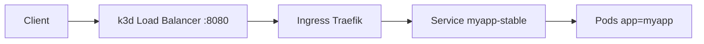
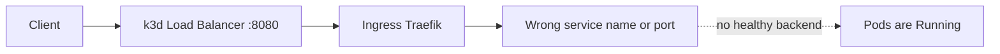

# Kubernetes Troubleshooting Lab (k3d)

## Goal
Practice troubleshooting in a repeatable order, from workload health to external reachability.

Lab stack:
- local `k3d` cluster
- Traefik Ingress controller
- `nginx` app

## Local UIs and port usage
Use these URLs while running the lab:

| Component | URL | Notes |
| --- | --- | --- |
| k3d LoadBalancer / Traefik path | `http://localhost:8080` | Reserved by k3d `serverlb` (`80 -> 8080`) |
| Istio ingress test path | `http://localhost:18080` | Via `kubectl port-forward` to Istio ingress |
| Argo CD UI | `https://localhost:8081/` | Kept on `8081` because `8080` is already used by k3d LB |
| Argo Rollouts dashboard | `http://localhost:3100/rollouts` | `kubectl argo rollouts dashboard` |
| Kiali UI | `http://localhost:20001/kiali` | `istioctl dashboard kiali` |
| Grafana UI | `http://localhost:3000` | via port-forward |
| Prometheus UI | `http://localhost:9090` | via port-forward |

Important:
- Even if you are not actively using Traefik, `localhost:8080` remains occupied by the k3d load balancer mapping.
- To reuse `8080` for another UI, you must recreate the cluster with a different LB port mapping.

## Istio + Kiali (what we did in this lab)
This is the exact Istio/Kiali flow used during the session.

1. Enable sidecar injection on `default` namespace and restart app pods:
```powershell
kubectl label ns default istio-injection=enabled --overwrite
kubectl rollout restart deploy/myapp-deployment
kubectl rollout status deploy/myapp-deployment
kubectl get po -l app=myapp
```
Expected:
- pods for `myapp-deployment` become `2/2` (`nginx` + `istio-proxy`)

2. Apply Istio routing objects:
```powershell
k apply -f .\istio\myapp-gateway.yaml
k apply -f .\istio\myapp-vs-good.yaml
```

3. Port-forward Istio ingress and open Kiali:
```powershell
kubectl port-forward -n istio-system svc/istio-ingress 18080:80
istioctl dashboard kiali
```

4. Generate continuous traffic (PowerShell):
```powershell
while ($true) { curl.exe -s -o NUL -H "Host: myapp.local" http://localhost:18080; Start-Sleep -Milliseconds 200 }
```

5. Validate path with Istio endpoint:
```powershell
curl.exe -i -H "Host: myapp.local" http://localhost:18080
```

6. Simulate breakage and observe in Kiali:
- break `Service` selector (set wrong label in `services/myapp-stable.yaml`)
- apply change
```powershell
k apply -f .\services\myapp-stable.yaml
k get ep myapp-stable
curl.exe -i -H "Host: myapp.local" http://localhost:18080
```
Expected:
- `k get ep myapp-stable` returns `<none>`
- curl returns `503 Service Unavailable` with `no healthy upstream`
- in Kiali Traffic Graph, edge `istio-ingress -> myapp-stable` turns red with error rate

7. Recover:
- restore correct selector (`app: myapp`) in `services/myapp-stable.yaml`
- re-apply and verify
```powershell
k apply -f .\services\myapp-stable.yaml
k get ep myapp-stable
curl.exe -i -H "Host: myapp.local" http://localhost:18080
```
Expected:
- endpoints repopulate
- curl returns `200`
- Kiali graph becomes green again (usually after a short refresh window)

## Incident index
1. Incident 1: Pods are not `Ready` or do not start.
2. Incident 2: Pods are `Running` but the app is not reachable from outside.
3. Incident 3: Ingress is broken (wrong backend service name or backend service port).
4. Incident 4: Ingress class mismatch (`ingressClassName` does not match the active controller).
5. Incident 5: NetworkPolicy blocks traffic to app pods (`502 Bad Gateway` from Ingress).
6. Incident 6: Egress policy layering (deny all + selective allow rules).

## Visual troubleshooting map
Normal path:
```text
Client -> k3d LB -> Ingress -> Service -> Pod
```



## Incident 1 (Pods not Ready / not starting)
```text
Flow break: Client -> k3d LB -> Ingress -> Service -> X Pod (ImagePullBackOff / CrashLoopBackOff / NotReady)
```

Start here when pods are in states like `Pending`, `ImagePullBackOff`, `CrashLoopBackOff`, `Error`.

```powershell
k get po -o wide
k describe po <pod-name>
k logs <pod-name> --all-containers=true
k logs <pod-name> --all-containers=true --previous
k get events --sort-by=.metadata.creationTimestamp
```

Tip:
- If pods are not `Ready`, services can still show empty endpoints.

## Incident 2 (Pods Running, app unreachable)
```text
Flow break: Client -> k3d LB -> Ingress -> Service -> X Endpoints <none> (selector mismatch)
```

Use this when pods look healthy but external requests fail (`404`, `503`, timeout).

```powershell
k get po --show-labels
k get svc myapp-stable -o yaml
k get ep myapp-stable -o wide
k get ing myapp-ing -o yaml
curl.exe -i -H "Host: myapp.local" http://localhost:8080
docker ps --filter "name=k3d-sim-alb-serverlb" --format "table {{.Names}}`t{{.Ports}}"
```

## Incident 3 (Broken Ingress)
```text
Flow break: Client -> k3d LB -> Ingress -> X Service ref (wrong backend name/port)
```



Use this when pods and service look healthy, but routing through Ingress fails.

Common causes covered in this lab:
- wrong backend service name in Ingress (for example `myapp-stable-typo`)
- wrong backend service port in Ingress (for example `81` instead of `80`)

## Incident 4 (Ingress Class Mismatch)
```text
Flow break: Client -> k3d LB -> X Ingress not handled by active controller (wrong ingressClassName)
```

Use this when Ingress exists but is not processed by the expected controller.

Example:
- expected class: `traefik`
- misconfigured class: `nginx`

Quick checks:
```powershell
k get ingressclass
k get ing myapp-ing -o yaml
curl.exe -i -H "Host: myapp.local" http://localhost:8080
```

Realtime steps:
1. Run `k get ingressclass` and confirm the active class is `traefik`.
2. Check `ingressClassName` in `myapp-ing`.
3. If class is wrong (for example `nginx`), requests will fail even if pods and service are healthy.

Important note:
- `PARAMETERS: <none>` in `k get ingressclass` is normal for this Traefik setup.
- Treat class name/controller mismatch as the real issue, not `PARAMETERS: <none>`.

Fix:
- set `ingressClassName: traefik` in `ingress/myapp-ing.yaml`
- re-apply the manifest

## Incident 5 (NetworkPolicy Blocking Pod Traffic)
```text
Flow break: Client -> k3d LB -> Ingress -> Service -> X Pod traffic blocked by NetworkPolicy (502 Bad Gateway)
```

Use this when Ingress exists and routes, but backend traffic to pods is blocked by policy.

Quick checks:
```powershell
k get netpol
curl.exe -i -H "Host: myapp.local" http://localhost:8080
```

Example from this lab:
```text
NAME                  POD-SELECTOR   AGE
allow-http-to-myapp   app=myapp      71s
deny-all-to-myapp     app=myapp      5m4s
```

Typical symptom:
- request returns `HTTP/1.1 502 Bad Gateway`

Files used in this lab:
- `networkpolicy/deny-myapp.yaml`
- `networkpolicy/allow-http-myapp.yaml`

Commands used:
```powershell
k apply -f .\networkpolicy\deny-myapp.yaml
k apply -f .\networkpolicy\allow-http-myapp.yaml
k get netpol
curl.exe -i -H "Host: myapp.local" http://localhost:8080
```

Recovery shortcut:
```powershell
k delete netpol deny-all-to-myapp
curl.exe -i -H "Host: myapp.local" http://localhost:8080
```

## Incident 6 (Egress Policy Layering)
```text
Flow break: Pod (app=myapp) -> X outbound egress blocked (deny all baseline)
```

Use this to test outbound traffic control for pods with label `app=myapp`.

Key concept:
- NetworkPolicy rules are additive (union model), not sequential overrides.
- `deny-all-egress` sets the baseline (block all egress).
- `allow-dns` opens only DNS (`53/udp` and `53/tcp`).
- `allow-https` opens only HTTPS (`443/tcp`).

Final result for `app=myapp`:
- Allowed: DNS (`53/udp`, `53/tcp`) and HTTPS (`443/tcp`).
- Blocked: everything else.

Files used in this lab:
- `networkpolicy/deny-all-egress-myapp.yaml`
- `networkpolicy/allow-dns-egress-myapp.yaml`
- `networkpolicy/allow-https-egress-myapp.yaml`

Step-by-step execution (real test flow):
1. Start clean:
```powershell
k delete netpol deny-all-egress-myapp allow-dns-egress-myapp allow-https-egress-myapp
```
2. Apply only deny-all egress:
```powershell
k apply -f .\networkpolicy\deny-all-egress-myapp.yaml
k run -it --rm dns-debug --image=busybox:1.36 --restart=Never --labels app=myapp -- sh
```
3. Test inside pod (expected fail):
```sh
nslookup google.com
```
Expected output pattern:
```text
nslookup: write to '10.43.0.10': Connection refused
;; connection timed out; no servers could be reached
```
4. Apply DNS allow and retest:
```powershell
k apply -f .\networkpolicy\allow-dns-egress-myapp.yaml
k run -it --rm dns-debug --image=busybox:1.36 --restart=Never --labels app=myapp -- sh
```
Inside pod:
```sh
nslookup google.com
wget -T 5 -qO- https://example.com
```
Expected:
- `nslookup` works
- `https` still blocked

5. Apply HTTPS allow and retest:
```powershell
k apply -f .\networkpolicy\allow-https-egress-myapp.yaml
k run -it --rm dns-debug --image=busybox:1.36 --restart=Never --labels app=myapp -- sh
```
Inside pod:
```sh
nslookup google.com
wget -T 5 -qO- https://example.com
wget -T 5 -qO- http://example.com
```
Expected:
- DNS works
- HTTPS works
- HTTP (port 80) remains blocked

## CI Note: Trivy Misconfig Failure and Fix
Trivy failed in CI on `deployments/deployment.yaml` with:
- `KSV-0014 (HIGH)`: missing `readOnlyRootFilesystem: true`
- `KSV-0118 (HIGH)`: default/weak `securityContext` at container level
- `KSV-0118 (HIGH)`: default/weak `securityContext` at pod level

Fix applied in `deployments/deployment.yaml`:
- pod `securityContext` with `runAsNonRoot: true` and `seccompProfile: RuntimeDefault`
- container `securityContext`:
- `runAsNonRoot: true`
- `runAsUser: 101`
- `runAsGroup: 101`
- `allowPrivilegeEscalation: false`
- `readOnlyRootFilesystem: true`
- `capabilities.drop: [ALL]`
- `capabilities.add: [NET_BIND_SERVICE]`
- writable `emptyDir` mounts for nginx runtime paths:
- `/var/cache/nginx`
- `/var/run`
- `/tmp`

Local pre-push check (same as CI profile):
```powershell
docker run --rm -v "${PWD}:/work" -w /work aquasec/trivy:0.69.3 fs --scanners misconfig --severity HIGH,CRITICAL --exit-code 1 .
```

## Traffic flow
`Client -> localhost:8080 -> k3d loadbalancer -> Ingress -> Service -> Pod`

## In-cluster DNS test (from Pod, not from Node)
Use this to validate Kubernetes service discovery and internal service reachability.

Run from a temporary pod:
```powershell
k run -it --rm dns-test --image=busybox:1.36 --restart=Never -- sh
```

Inside the pod:
```sh
nslookup myapp-stable
wget -qO- http://myapp-stable
```

Important:
- run DNS/service tests from a pod, not from a k3d node container
- partial `NXDOMAIN` lines from busybox `nslookup` are normal if the fully-qualified service name resolves successfully

## Known root cause from this lab
- Wrong service selector (`app: wrong-label`) caused:
  - `Endpoints <none>`
  - Ingress had no usable backend
  - external response was `404`

Fix file:
- `services/myapp-stable.yaml`

## Full runbook
See `INCIDENT.md` for the full numbered runbook with decision steps and fixes.

